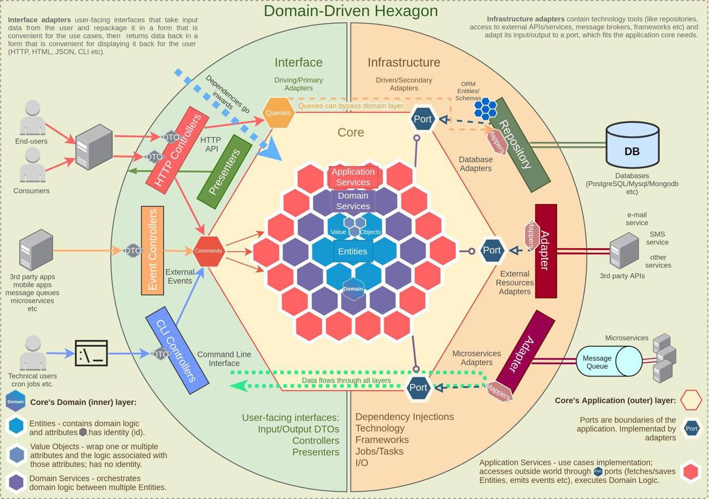
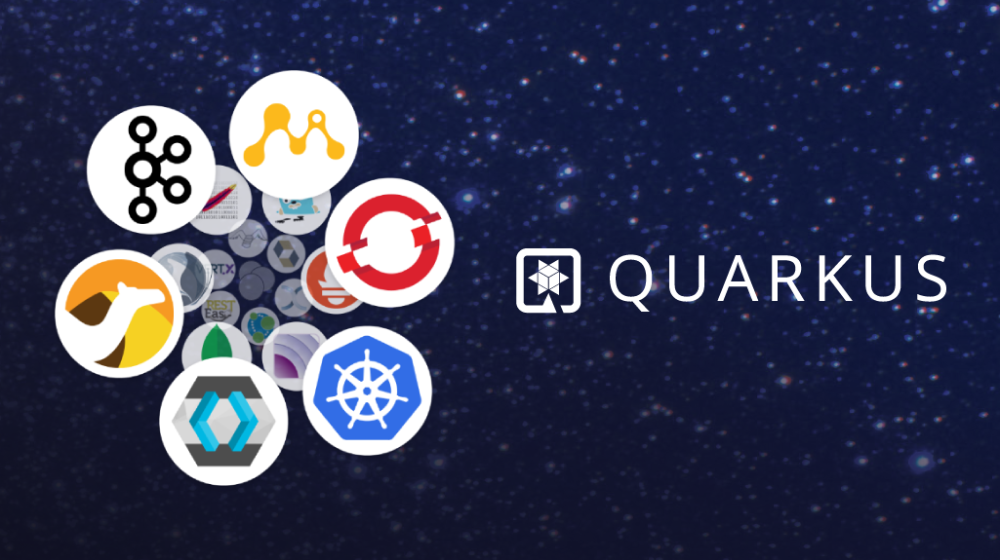

# Shopping Example Application
**D**omain **D**riven **D**esign **MSA** **E**vent **S**ourcing Shopping example application written using **T**est-**D**riven **D**evelopment - **TDD** and **Inversion of Control** and **Dependency Injection** with Quarkus

## Customer Service

### Customer Service Bounded Context.

In shopping application, Bounded Context was applied to customer management (Customer), order management (Order - coming soon), product management (Product - coming soon), and delivery management (Delivery - coming soon) according to the required functions, and services were divided based on the bounded context.



##What is Quarkus?

Traditional Java stacks were engineered for monolithic applications with long startup times and large memory requirements in a world where the cloud, containers, and Kubernetes did not exist. Java frameworks needed to evolve to meet the needs of this new world.

Quarkus was created to enable Java developers to create applications for a modern, cloud-native world. Quarkus is a Kubernetes-native Java framework tailored for GraalVM and HotSpot, crafted from best-of-breed Java libraries and standards. The goal is to make Java the leading platform in Kubernetes and serverless environments while offering developers a framework to address a wider range of distributed application architectures.



## Getting Started
To install, run the following commands

```
git clone https://github.com/akhunovaa/customer-service.git
cd customer-service
mvn clean package
java -jar target/customer-service-1.0.0-native-image-source-jar/customer-service-1.0.0-runner.jar
```

